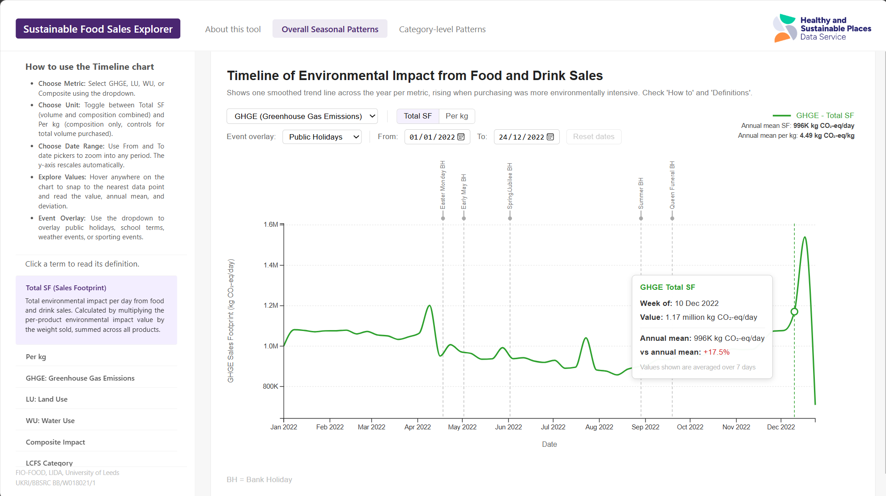
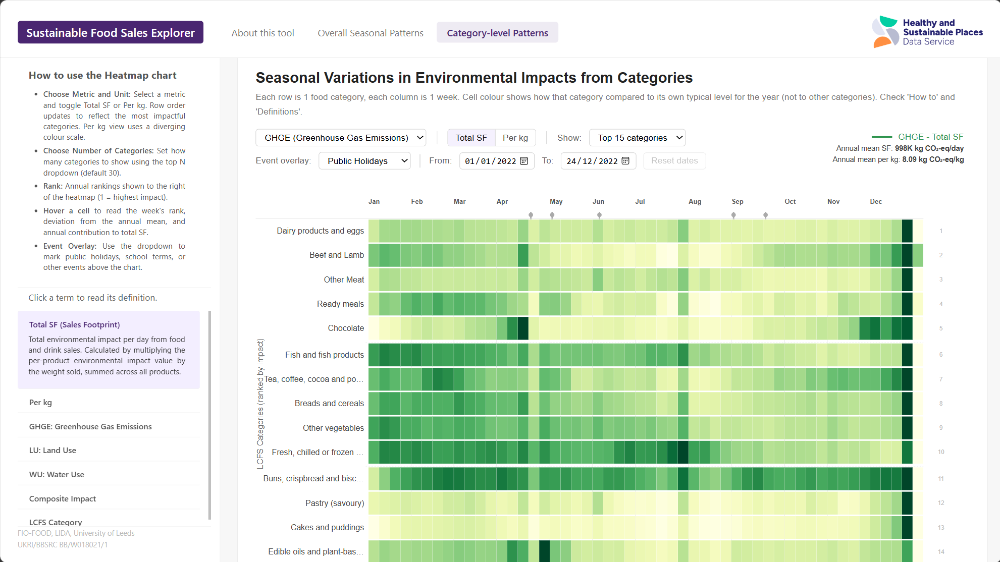

# Sustainable Food Sales Explorer (Dashboard)



An interactive web dashboard for exploring the seasonal environmental impact of food and drink purchasing in the UK. Built with D3.js and deployed as a static site (GitHub Pages) for the current prototype.

Developed by the [Healthy and Sustainable Places (HASP) Data Service](https://hasp.ac.uk) as part of the FIO Food project at the University of Leeds.

---

## Overview

The FIO Food Environmental Impact Seasonal Explorer (FIO-EISE) lets researchers explore how the environmental footprint of food purchasing changes across a calendar year, broken down by environmental metric and food category. It is built on anonymised weekly transaction data from a major UK grocery retailer covering Yorkshire and Humber in 2022.

The dashboard has two charts on separate tab pages:

| Chart | Description |
|---|---|
| **Timeline** | Smoothed weekly trend for one environmental metric. Entry point for identifying periods of elevated or reduced footprint. |
| **Heatmap** | 65 LCFS food categories x 52 weekly bins. Cell colour shows each category's footprint relative to its own annual typical level. |

Each chart has its own independent metric selector, Total SF / Per kg toggle, event overlay dropdown, and date pickers. Charts initialise lazily on first activation so container width is always readable before rendering.

> **Prototype status:** All patterns shown use dummy data generated outside the Trusted Research Environment (TRE). Real 2022 retailer data will be connected following VRE validation and approval.



---

## Project Structure

```
fio_dashboard/
├── index.html                  # Three-tab shell: About | Timeline | Heatmap
├── serve.py                    # Local HTTP server (one command)
│
├── css/
│   └── dashboard_V3.css        # Layout, nav, sidebar, glossary, chart cards
│
├── js/
│   ├── trend_chart_V3.js       # createTrendChart(): D3 timeline chart
│   ├── heatmap_V3.js           # createHeatmap(): D3 heatmap chart
│   └── dashboard_V3.js         # Data loading, chart init, tab and accordion logic
│
├── data/
│   ├── L1_rolling_updated.json # Weekly bin trend values (52 rows)
│   └── L2a_weekly_updated.json # Weekly category-level values (3,380 rows)
│
├── notebooks/
│   ├── notebook_01_L1_dummy.py # Generates L1_rolling_updated.json
│   └── notebook_02_L2a_dummy.py # Generates L2a_weekly_updated.json
│
└── README.md
```

---

## Getting Started

### Prerequisites

- Python 3.8 or later (no additional packages: uses built-in `http.server`)
- A modern browser (Chrome, Firefox, or Safari)
- Internet connection on first load (D3.js v7 loaded from CDN)

### Running locally

```bash
git clone <repo-url>
cd fio_dashboard
python serve.py
```

The dashboard opens automatically at `http://localhost:8000` on the About page. Click either chart tab to load the charts.

> `serve.py` must be run from the `fio_dashboard/` root directory. Opening `index.html` directly in a browser blocks `fetch()` calls to local files due to the browser same-origin policy.

### Live link (GitHub Pages)

The dashboard is also deployed at:
```
https://piyushmohan01.github.io/FIO-Sustainability-Dashboard-Repo/
```

No server required. Data files are fetched directly from the repo. Project Case Study link will shortly be included.

### Regenerating data

```bash
python notebooks/book-01.ipynb
python notebooks/book-02.ipynb
python notebooks/book-03.ipynb
```

The scripts write output files to `data/`. Refresh the browser after
regeneration.

---

## Environmental Metrics

All three metrics are derived from per-product environmental impact estimates sourced from Poore and Nemecek (2018), scaled by the total weight of products sold each week.

| Metric | Description | Unit (Total SF) | Unit (Per kg) |
|---|---|---|---|
| **GHGE** | Greenhouse Gas Emissions | kg CO₂-eq / day | kg CO₂-eq / kg |
| **LU** | Land Use | m²·yr / day | m²·yr / kg |
| **WU** | Water Use | L / day | L / kg |
| **Composite Impact** | Normalised average of all three | 0–1 scale | 0–1 intensity scale |

### Total SF vs Per kg

**Total SF** Total environmental impact per day from food and drink sales. Calculated by multiplying the per-product environmental impact value by the weight sold, summed across all products. 

**Per kg** Average environmental impact per kilogram of food purchased. Shows basket composition independently of purchasing volume. Changes when the relative mix of products shifts toward higher or lower impact items.

---

## Data Files

### L1_binavg_updated.json

Weekly bin values for the full year at basket level. 52 rows: one per Jan-01 anchored 7-day bin.

| Column | Description |
|---|---|
| `week_start` | First date of the 7-day bin (YYYY-MM-DD) |
| `binavg_GHGE_SF` | 7-day bin mean total GHGE sales footprint |
| `binavg_LU_SF` | 7-day bin mean total Land Use sales footprint |
| `binavg_WU_SF` | 7-day bin mean total Water Use sales footprint |
| `binavg_composite_norm` | 7-day bin mean normalised composite (0–1) |
| `binavg_GHGE_perkg` | 7-day bin mean GHGE per kg sold |
| `binavg_LU_perkg` | 7-day bin mean Land Use per kg sold |
| `binavg_WU_perkg` | 7-day bin mean Water Use per kg sold |
| `binavg_composite_intensity_norm` | 7-day bin mean composite intensity (0–1) |

Bin 1: Jan-01 to Jan-07. Bin 52: Dec-24 to Dec-30. No null boundary rows: every bin has exactly 7 days of data. Christmas Day (Dec-25) is set to zero before binning; the visible dip in bin 52 is expected.

### L2a_weekly_cat30.json

Weekly bin values disaggregated to 65 LCFS food categories. 3,380 rows total (52 bins x 65 categories). 

Bins are Jan-01 anchored: Week 1 = Jan-01 to Jan-07, Week 2 = Jan-08 to Jan-14. The `week_start` field holds the first date of each bin.

Key columns alongside `week_start` and `lcfs_cat`:

| Column pattern | Description |
|---|---|
| `{M}_weekly_mean` | Mean of daily SF values within the bin (M = GHGE, LU, WU) |
| `{M}_perkg_weekly_mean` | Mean of daily per-kg values within the bin |
| `{M}_weekly_rank` | Category rank by weekly mean among all 65 |
| `{M}_annual_mean` | Annual mean of weekly bin means per category |
| `{M}_annual_share` | Category fraction of grand total annual SF (%) |
| `{M}_annual_min / max` | Weekly bin mean range across the year per category |
| `{M}_annual_rank` | Rank by annual mean SF (1 = highest impact) |
| `{M}_pct_from_annual_mean` | % deviation of weekly mean from annual mean |
| `{M}_perkg_annual_mean` | Annual mean of per-kg weekly bin means |
| `{M}_perkg_max_abs_dev` | Diverging scale half-width for per-kg colour domain |
| `{M}_perkg_annual_rank` | Rank by annual mean per-kg (1 = highest) |
| `{M}_perkg_pct_from_annual_mean` | % deviation of per-kg value from per-kg annual mean |
| `calendar_month` | 0-based month index of the bin's first date |

---

## Chart Architecture

Both chart functions are standard D3 v7. They have no Observable or framework dependencies and return a plain DOM node via `container.node()`.

### createTrendChart(data, { width })

Located in `js/trend_chart_V3.js`. Receives the `L1_rolling_updated.json` array and a pixel width. Reads `week_start` and maps it to `d.date` for all internal scale and tooltip logic.

**Internal state variables:**

| Variable | Type | Description |
|---|---|---|
| `activeMKey` | string | Active metric: `"GHGE"`, `"LU"`, `"WU"`, `"composite"` |
| `activePkg` | boolean | `false` = Total SF, `true` = Per kg |
| `activeEventGroup` | string | Active event overlay group key |
| `xScale` | d3.scaleTime | Hoisted to outer scope for `redrawEventMarkers()` |
| `totalWidth` | number | Outer SVG width, updated by ResizeObserver |
| `W` | number | Inner chart width (totalWidth minus margins), updated by ResizeObserver |
| `H` | number | Chart grid height, scales proportionally with width (min 180px, max 300px) |

**Redraw trigger chain:**

```
User interaction or ResizeObserver
  |
D3 handler or applyNewH() updates state / dimensions
  |
redraw() called
  |
plotData filtered from pre-built smoothed[] or smoothedPkg[] arrays
  |
xScale (hoisted) and yScale recomputed from current W and H
  |
x-axis tick format and density adapt to W (full format >= 400px,
  short format 200-400px, quarterly < 200px)
  |
Axes, gridlines, redrawEventMarkers(), trend line, tooltip redrawn
```

Composite Impact: y-axis always fixed to [0, 1] regardless of data range, with explicit tick values [0, 0.2, 0.4, 0.6, 0.8, 1.0].

### createHeatmap(weeklyData, { width, onStats })

Located in `js/heatmap_V3.js`. Receives the `L2a_weekly_updated.json` array only (no daily file). The `onStats` callback is optional.

**Internal state variables:**

| Variable | Type | Description |
|---|---|---|
| `activeMetric` | string | Active metric: `"GHGE"`, `"LU"`, `"WU"` |
| `activePkg` | boolean | `false` = Total SF, `true` = Per kg |
| `activeN` | number | Category rows displayed: 10, 15, or 30
| `activeEventGroup` | string | Active event overlay group key |
| `totalWidth` | number | Chart render width, floored at MIN_CHART_WIDTH |
| `W` | number | Inner chart width (totalWidth minus margins) |


**Redraw trigger chain:**

```
User interaction or ResizeObserver
  |
D3 handler updates activeMetric / activePkg / activeN / date range
  |
redraw() called
  |
Column names resolved from activeMetric + activePkg
  |
sortedCats ordered by pre-computed annual rank (no d3.rollup)
  |
weekKeys filtered, displayDates and displayValues built from weeklyMap
  |
chart_H computed from activeN (MIN_CHART_H 270 to MAX_CHART_H 1200)
  |
bodySVG height updated to chart_H + MARGIN.bottom
  |
monthGroup and eventGroup cleared and redrawn in headerSVG
  |
rowScales built per category:
  Total SF: d3.scaleSequential (per-row extent)
  Per kg:   d3.scaleDiverging centred on annual mean
  |
Cells, category labels, rank axis, colour legend redrawn in bodySVG
  |
onStats(periodSFTotal, periodPkgAvg, cfg) fired if provided
```

**Colour schemes:**

| Metric | Total SF interpolator | Per kg interpolator |
|---|---|---|
| GHGE | `d3.interpolateYlGn` | Custom: pink to white to green |
| LU | `d3.interpolateYlOrBr` | Custom: blue to white to orange |
| WU | `d3.interpolateYlGnBu` | Custom: pink to white to blue |

Per-kg diverging domain per category:
`[annual_mean - max_abs_dev, annual_mean, annual_mean + max_abs_dev]` where `max_abs_dev` is pre-computed in Python and stored in
`{M}_perkg_max_abs_dev`.

---

## Dashboard Layout

The dashboard uses a fixed nav bar + conditional sidebar + scrollable right panel layout. The About page occupies the full viewport width without a sidebar. Chart pages use a two-column grid.

```
Fixed nav bar (full width, z-index 100, always on top)
  Brand: Sustainable Food Sales Explorer (purple pill)
  Tab buttons: About this tool | Overall Seasonal Patterns | Category-level Patterns
  Logo block: HASP Data Service (far right)

About tab active:
  about-page-panel (position: fixed, full width below nav, scrollable)
    Two-column text layout:
      Left: title, about the dashboard, funding information, controls, suggested steps
      Right: metrics, timeline and heatmap chart instructions

Chart tab active:
  chart-layout grid:
    Sidebar (fixed):
      How-to text block for the active chart
      Glossary accordion (7 cards, one open at a time)
        Shared open state: switching tabs preserves which card is open
      Footer: funding attribution
    Right panel (scrollable, overflow-y: scroll):
      Chart panel with chart-section card
```

**Glossary:** one card open at a time. `activeGlossaryIndex` is shared across both sidebars so the same card position remains open when switching between chart tabs.

---

## LCFS Food Categories

The dashboard uses 65 food categories following the ONS Living Costs and Food Survey (LCFS) classification. The full category list is available in `notebooks/notebook_02_L2a_dummy.py` under the `LCFS_CATS` constant. A set of 30 categories was derived for the dashboard.

---

## Event Overlays

Both charts include an event overlay dropdown with five groups:

| Group | Contents |
|---|---|
| Public Holidays | UK bank holidays for the data year |
| Cultural Events | Christmas, Easter, Mother's Day, Halloween, Diwali, Ramadan, Father's Day |
| School Calendar | England term start and end dates (SH-1 through SH-6) |
| Weather Events | Heatwave peak dates with duration in days |
| Sporting Events | Six Nations, UEFA Women's Euro, FIFA World Cup (start/end) |

Event markers appear as a dot and short tick line above the chart cells in the heatmap (inside the sticky header) and as a dashed vertical line with tick above the chart grid in the timeline. Hover on any marker to read the event name and date. Footnote below each chart updates with the abbreviation key for the active group (BH, SH, HW, CG, SN, WC, WE).

---

## Citation and Funding

```
FIO-EISE Dashboard (2026). HASP Data Service, University of Leeds.
UKRI/BBSRC BB/W018021/1.
```

The research leading to these results has received funding through the Transforming the UK Food System (TUKFS) for Healthy People and a Healthy Environment SPF Programme, delivered by UKRI, in partnership with the Global Food Security Programme, BBSRC, ESRC, MRC, NERC, Defra, DHSC, OHID, Innovate UK and FSA (FIO-Food award: BB/W018021/1).

---